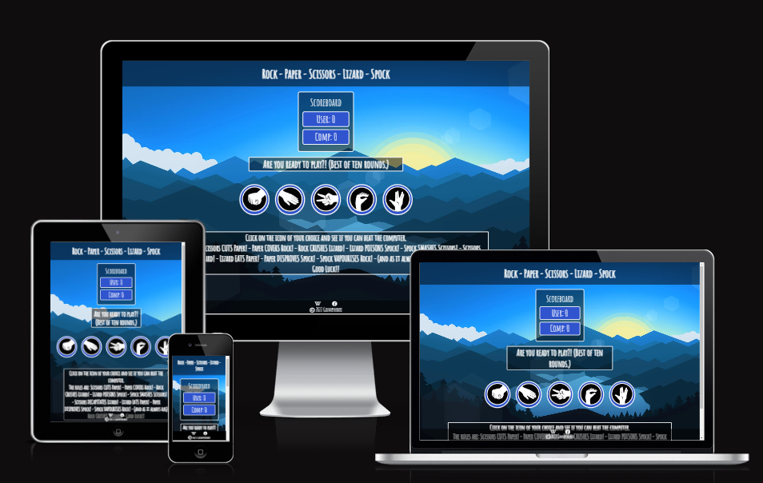
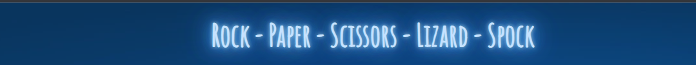
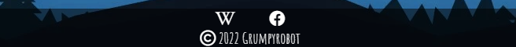
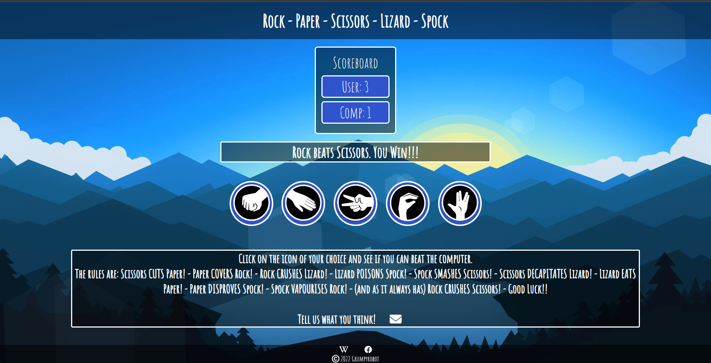
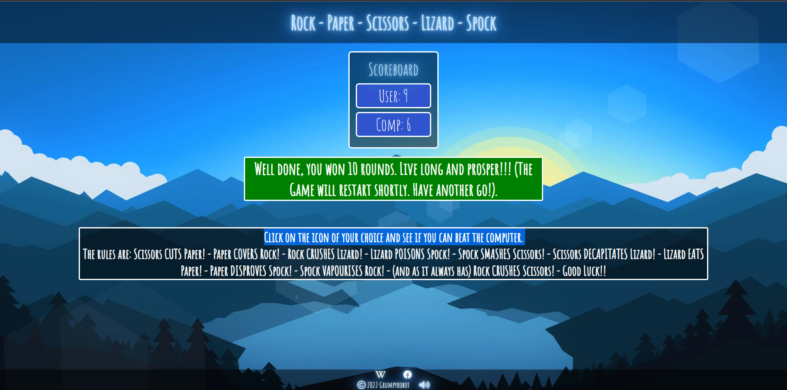
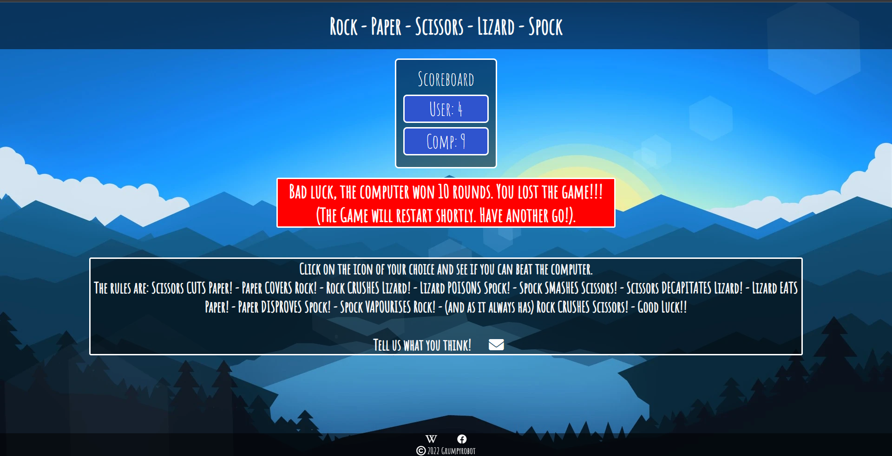
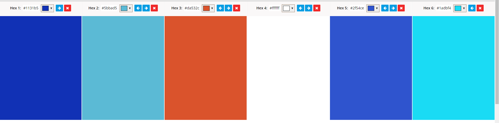

# **[Rock - Paper -Scissors - Lizard - Spock](https://grumpyrobot21.github.io/Rock-Paper-Scissors-Lizard-Spock---Portfolio-Project-2---JavaScript-Essentials/)**

## **Milestone Portfolio Project 2 - JavaScript Essentials - Code Institute Full Stack Developer Diploma.**

  

  

## Table of contents

- <a href="#intro">Introduction</a>
- <a href="#dg">Design Goals</a>
- <a href="#df">Design Features</a>
- <a href="#us">User Story</a>
- <a href="#wire">Wireframes</a>
- <a href="#test">Testing</a>
- <a href="#dep">Deployment</a>
- <a href="#pib">Previous Iterations and Bugs</a>
- <a href="#fa">Future Aspirations</a>
- <a href="#tools">Tools used and Coding Inspiration</a>

<a href="#home">Top of page</a>

## **INTRODUCTION.**

This web application has been developed in order to apply the topics covered within the recent Javascript essential course work as part of the Code Institute Full Stack Software Developer diploma. The website represents a Rock Paper Scissors Lizard Spock game based on the premise presented in the popular TV series, 'The Big Bang Theory'. This game pits the user against the computer in a game of chance. To view the full website please use the clickable link via the heading at the top of this page or alternatively, click on the following link to access the site: [Rock Paper Scissors Lizard Spock](https://grumpyrobot21.github.io/Rock-Paper-Scissors-Lizard-Spock---Portfolio-Project-2---JavaScript-Essentials/)

<a href="#home">Top of page</a>

## **DESIGN GOALS.**

The brief was to create an interactive application that presents users with an enjoyable game of chance. The principle features included are a game that employs a pattern matching functionality with a limited number of tries before the game is completed. The score must be tracked and it must provide the facility to play against 'the computer'. In addition a competitive element has been added with colourful and entertaining visual and audio cues to engage the users interest.

p align="right"><a href="#home">Top of page</a>

## **DESIGN FEATURES.**

- ### **Header Bar.**

  

This is a simple header displaying the title of the game. 

- ### **Footer.**

  

The footer has been designed to be informative and simple in it's presentation. It should not detract from the main page content yet provide relevant and helpful information for the user to engage with when required. The links to social media icons are clearly displayed. The icons are animated when the cursor is hovered above to clearly indicate which icon is being engaged by the user. Each link opens the relevant page in a separate tab. 

- ### **Page Design.**
  The single page design has been specifically created to portray a clean, fun and engaging experience for the user. The page content presented in a clear and accessible fashion for the user to understand.

1.  #### **Main Page.**

 

 

Below the navbar is the main game play area. This has the scoreboard clearly defined at the top of the page and the player feedback section immediately below. The game icons are laid out beneath that and they are aniimated to clearly show the user which one they are engaging with. The rules and how to play the game are in the box below giving the user clear instructions on how to play.

There are two altrnatives to this screen when the game is either won or lost. The dialogue boxes are coloured appropriately depending on the scenario and the text is either celebratory or comiseratory.

- ## WIN **SCREEN**

 

 

 - ## **LOSE SCREEN**

 

 

- ## **COLOUR PALETTE.**
  The colour palette is purposefully simple and clean. It consists of the following six colour choices: 

  

    

 

These colours provide a high level of contrast for users with impaired vison, as confirmed in the testing section below. They also add to the overall goal of creating a clear, engaging and fun design ethos. The colors were chosen in conjunction with the background image to present a smooth, related connection across the application. This helps provide consistency to the overall aesthetic flow of the user experience.

- ### **Font.**
  The font used for the page is Amatic SC. It is a simple but effective hand drawn webfont. It was initially designed by Vernon Adams, and concieved of to be used freely across the internet. It features both Latin and Hebrew alphabets. The Latin was initially designed by Vernon Adams. The Hebrew was designed by Ben Nathan, who also revised the Latin design. Thomas Jockin respaced and kerned the whole font.
---

<a href="#home">Top of page</a>

## **USER STORY.**

For the purposes of this story, our 'First time' user will be called 'Bob'. Bob likes playing games of chance.

- Bob has looked up the site because he wants to have a go at beating the computer playing the famous game from the tv show 'Big Bang Theory'. Bob has navigated to the home page and is immediately presented with a clean and clear, easy to understand game interface. Bob reads the game play instructions and starts clicking on his chosen game icons. When Bob wins a game of ten rounds he gets a cheery and uplifting text box congratulating him on his win accompanied by a brief winning sound. This encourages Bob to play agin.

- When Bob loses a game of ten rounds he is presented with a comiseratory text box accompanied by a losing sound and encouraged to play again to see if he can win.

- Each time a game is won or lost the game automatically resets after a brief pause.

* ### **Returning Users.**
  The game is designed to be simple and fun in order to encourage users to come back and try their luck as many times as they want.

---

<a href="#home">Top of page</a>

## **WIREFRAMES.**

For the main page the wireframe preliminary layout design can be seen below. This was created using [Balsamiq](https://balsamiq.com/):

## **TESTING.**

- ### **HTML Testing**
  The following test results were achieved for the page using the [W3C Markup Validation Service](https://validator.w3.org/)

- ### **CSS Testing**
  The following test results were achieved for the page using the [W3C CSS Validation Service](https://jigsaw.w3.org/css-validator/)
- index.html

- ### **Chrome Dev Tools - Lighthouse - Testing**
  The Chrome dev tool - Lighthouse - Tests the overall performance, Accessibility, Web Development best practices and SEO. The following results were confirmed:

- ### **Responsiveness Testing**

The following sites were used to test the web applications responsiveness: [Am I Responsive](https://ui.dev/amiresponsive) and [Media Genesis Responsive Design Checker](https://responsivedesignchecker.com/)

- The 'Am I responsive generator' result image has been used at the start of this readme file. Please see the image at the top for the results. This page focuses on the following image viewport sizes -
  Desktop
  1600x992px scaled down to scale(0.3181)
  Laptop
  1280x802px scaled down to scale(0.277)
  Tablet
  768x1024px scaled down to scale(0.219)
  Mobile
  320x480px scaled down to scale(0.219). The site results indicate good performance on all viewport sizes.

- The Media Genesis page gives the option to test the page on several different viewport screen sizes from Desktop 24 inch 1920 x 1200px resolution all the way down to the mobile viewport size of 320 x 480px. The site performed very well on all viewport size options.

- ### **Contrast/ Accessibility Testing**

The [Wave Accessibilty testing tool](https://wave.webaim.org/) was used to check to test the page contrast and accessibilty of the application.

The colour contrast was AAA rated.

- ### **User Testing**

Friends and family were the resource used to extensively test the usability of the web application. All page links and button functionality were tested including ascertaining that all social media links opened in separate tabs and that all action buttons and nav links were correctly configured and redirected the user to the correct page, as indicated.

---

<a href="#home">Top of page</a>

## **DEPLOYMENT.**

The most recent iteration of the WebLife application has been deployed via Github pages. The following instructions clarify the process.

1. Log in to [GitHub](https://github.com/), access the specific GitHub Repository - [WebLife Digital Legacy Management](https://github.com/GrumpyRobot21/WebLife---Portfolio-Project-1---HTML-CSS-Essentials) (Hover over this link for the complete repository url)
2. Click on the 'Settings' icon in the menu below the repository title.
3. Click on the Pages option in the settings page menu on the left hand side of the screen.
4. Click on the dropdown button "None" and select 'Master' or 'Main' Branch".
5. This will cause the page to automatically refresh and a link to the fully deployed site will be displayed towards the top of the page. There may be a brief delay during this process to accomodate Github as it prepares the application for deployment.

Should you wish to 'Fork' or 'Clone' the repository please follow these instructions:

- ### **Forking the Repository**
  Forking enables a third party to create a copy of the repository in order to view and/or make changes without affecting the original.

1. Log in to [GitHub](https://github.com/), access the specific GitHub Repository - [WebLife Digital Legacy Management](https://github.com/GrumpyRobot21/WebLife---Portfolio-Project-1---HTML-CSS-Essentials)
2. Towards the top right of the repository page, underneath the user icon you will find and click the "Fork" Button.
3. You will now have successfully created a copy of the original repository within your GitHub account.

- ### **Cloning the Repository**
  Follow these instructions to create a clone of the repository within your local development environment to make it easier to fix merge conflicts, add or remove files, and push larger commits.

1. Log in to [GitHub](https://github.com/), access the specific GitHub Repository - [WebLife Digital Legacy Management](https://github.com/GrumpyRobot21/WebLife---Portfolio-Project-1---HTML-CSS-Essentials)
2. Above the file list on the repository page locate and click the 'Code' button (beside the 'Add file' button)
3. Copy the provided link depending on your desired option for either 'HTTPS', 'SSH key' or 'GitHub CLI.
4. Open Git Bash and change the current working directory to the location where you want the cloned directory to be made.
5. Type `git clone`, and then paste the specific URL you copied in Step 3.

---

<a href="#home">Top of page</a>

## **PREVIOUS ITERATIONS AND BUGS.**

The first iteration of this project was built without a proper uderstanding of the 'Mobile First' Developement concept. As a result it made it difficult to figure out the best approach to making the application responsive. Following engagement with Code Institute tutor support new concepts and ideas were discussed that helped resolve the decision to start again using some of the same design ideas but approaching the build from a new perspective. The end result was more responsive in its initial design from the ground up and as a result easier to complete than the first attempt.

- ### **Bugs**
  Apart from the usual spelling mistakes and formatting to tidy up, a number of bugs were identified during the testing phase and updated. These included but were not exclusively, having to add titles and aria labelling to the contact form to avoid the issue of not having specific labels **(The decision not to use labels in this instance was deliberate and in line with the specific design aspirations for the form layout.)**.

Updating the main images from .png files to .webp format in order to reduce loading times and caching issues.

Discovering redundant css styling while using the Chrome Developer tools but in the process understanding more about how these tools are extremely useful in the devlopment design and testing phase.

There will undoubtedly be other issues that I am currently unaware of and styling changes that I will make as I gain additional knowledge during the remaining course modules. It has been a very enjoyable albeit sometimes incredibly frustrating process but ultimately extremely rewarding and fun.

---

<a href="#home">Top of page</a>

## **FUTURE ASPIRATIONS.**

These include an online portal or client area to allow clients the access for online management of portflios held with WebLife. This would include a secure passord or biometrically protected client area where various levels of service and functionality would be offered. This would further facilitate the 'returning user' element of the site. A futher refining of the design will be part of the ongoing application development in future.

Including the functionality for an emailed form submission clarification for users. The option for users to sign up for regular news and service updates.

Discovering what Bootstrap is has been enlightening as it would obviously make the whole process a little quicker and easier. However, having to complete all the code personally means that during this process I have gained experience of simply writing code and not relying on a Framework to do the heavy lifting, although I will be taking advantage of this where I can in future.

<a href="#home">Top of page</a>

## **TOOLS USED AND CODING INSPIRATION.**

The following tools, pages and tutorials were invaluable in helping me complete this project:

- [HTML5](https://en.wikipedia.org/wiki/HTML5)
- [CSS3](https://en.wikipedia.org/wiki/CSS#CSS_3)
- [Javascript](https://en.wikipedia.org/wiki/JavaScript)
- [GitPod](https://www.gitpod.io/)
- [Visual Studio Code](https://code.visualstudio.com/)
- [GitHub](https://github.com/)
- [Google Fonts. Amatic SC font.](https://fonts.google.com/specimen/Amatic+SC?query=Amatic+)
- [Font Awesome Icons. Social media Icons.](https://fontawesome.com/)
- [Background art](https://www.wallpaperbetter.com/en/hd-wallpaper-zrucw)
- [Neon text animation effects](https://codepen.io/markheggan/pen/LjrVYN)
- [How to remove an element from the DOM using Javascript](https://www.w3schools.com/jsref/met_element_remove.asp)
- [Real Favicon Generator. Favicon design for cross platform functionality.](https://realfavicongenerator.net/)
- [Chrome Developer Tools. Application testing.](https://developer.chrome.com/docs/devtools/)
- [W3C Markup Validation Service. HTML testing.](https://validator.w3.org/)
- [W3C CSS Validation Service. CSS testing.](https://jigsaw.w3.org/css-validator/)
- [Am I Responsive. Responsiveness testing.](https://ui.dev/amiresponsive)
- [Media Genesis Responsive Design Checker. Responsiveness testing.](https://responsivedesignchecker.com/)
- [Wave Accessibilty testing tool. Accessibility and Contrast testing.](https://wave.webaim.org/)
- [Code Institute Tutor Support. Invaluable support and assistance. Excellent course material.](https://codeinstitute.net/ie/)
- [Slack community. Community support, shared experience and motivation.](https://slack.com/intl/en-ie/)

<a href="#home">Top of page</a>

